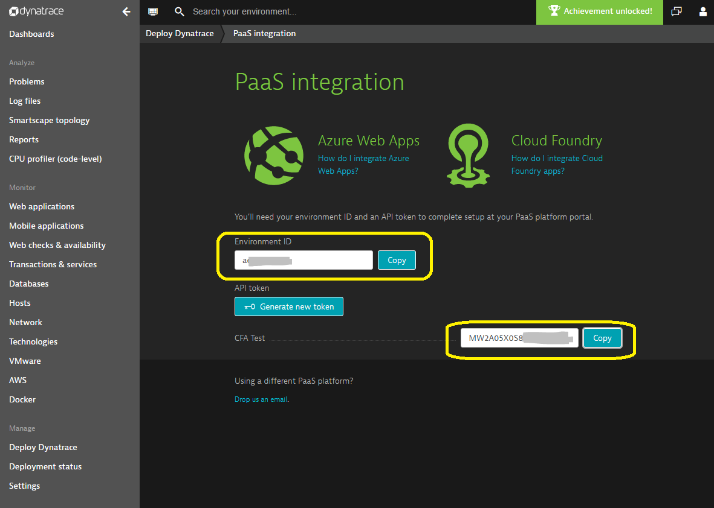

Dynatrace OneAgent for Microsoft Azure Cloud-Services
========================================

Dynatrace is a full-stack application monitoring solution that covers your entire application stack. Learn more on our website https://www.dynatrace.com/technologies/cloud-and-microservices/azure-monitoring/

Monitoring Azure Cloud-Services
-------------------------------
Azure Cloud-Services allows you to easily scale applications.
By modifying the .csdef file of your Cloud Service, you can easily trigger installation of the Dynatrace OneAgent as part of your regular deployment.
This file will guide you through the process of gathering any mandadory parameters from the Dynatrace dashboard and adding the according information to your Cloud Service solution. You might want to read through the whole process prior to actually following the instructions, as that you'll have a better understanding of what each single step means in scope of the whole process.

Your credentials
----------------
First, please gather your Dynatrace credentials from the Dynatrace dashboard. This is required for allowing the Dynatrace OneAgent to connect to your Dynatrace environment.

Please make sure you have that information available later.

Now, download the files install.ps1 and setupDynatrace.cmd from this repository. Those scripts make sure that the OneAgent is installed prior to starting up your services. The destination is different between Web Roles and Worker Roles:

Web-Roles
---------
Locate the bin folder inside your WebRole project and place the files Install.ps1 and setupDynatrace.cmd there.

Worker-Roles
------------
For Worker Roles, the files have to be added to the Cloud Service project, not the Worker Role project.

ServiceDefinition.csdef
-----------------------
Now that we have placed the files Install.ps1 and setupDynatrace.cmd to the projects, we need to make sure that they get executed when deploying the solution to Azure Cloud Service.
We need to complete several steps to make this happen. Please copy/paste the tags ConfigurationSettings, LocalResources and Startup from the code snippets below into the Web- and WorkerRole tags of the ServiceDefinition.csdef file in your solution. Please be aware that you need to do this for every Role in your Cloud Service.
The screenshot below the snippets shows how your ServiceDefinition.csdef file could look like after making the changes.

{code}
<ConfigurationSettings>
  <Setting name="Dynatrace.EnvironmentId" />
  <Setting name="Dynatrace.Token" />
</ConfigurationSettings>
{code}

{code}
<LocalResources>
  <LocalStorage name="StartupLocalStorage" sizeInMB="100" />
</LocalResources>
{code}

{code}
<Startup>
  <Task commandLine="setupDynatrace.cmd" executionContext="elevated" taskType="simple">
    <Environment>
      <Variable name="ENVIRONMENTID">
        <RoleInstanceValue xpath="/RoleEnvironment/CurrentInstance/ConfigurationSettings/ConfigurationSetting[@name='Dynatrace.EnvironmentId']/@value" />
      </Variable>
      <Variable name="TOKEN">
        <RoleInstanceValue xpath="/RoleEnvironment/CurrentInstance/ConfigurationSettings/ConfigurationSetting[@name='Dynatrace.Token']/@value" />
      </Variable>
      <Variable name="StartupLocalStorage">
        <RoleInstanceValue xpath="/RoleEnvironment/CurrentInstance/LocalResources/LocalResource[@name='StartupLocalStorage']/@path" />
      </Variable>
    </Environment>
  </Task>
</Startup>
{code}

When you're using VisualStudio, you'll recognize a Warning in your Solution Explorer. This is because we defined two mandatory parameters for the Dynatrace OneAgent (EnvironmentID and Token), which still need to be applied to all your Cloud Service configuration files (*.cscfg).

Open all your .cscfg files (eg one for each environment, like local or cloud) and two Settings to ConfigurationSettings:
      <Setting name="Dynatrace.EnvironmentId" value="-envid-" />
      <Setting name="Dynatrace.Token" value="-token-" />
The values are available from the Dynatrace dashboard and you should have them available already from the first step.
Again, please make sure that you need to add the settings to all roles you configured accordingly via the ServiceDefinition.csdef file.

CONTACT
-------
If you have any questions, don't hesitate to contact me via @MartinGoodwell on Twitter.
In case of problems, please create an issue on GitHub.
